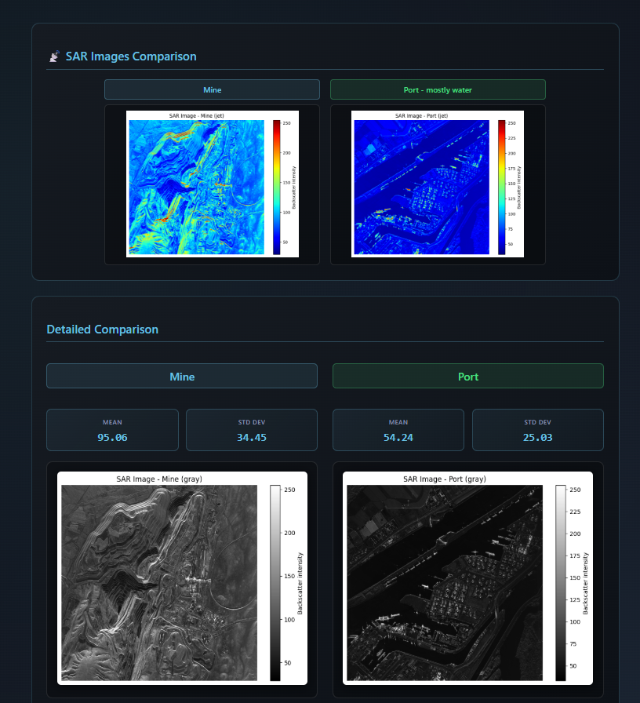

# **Multi Signal Viewer with AI detection**

> ## **Overview**

An integrated web-based application for **multi-domain signal visualization and analysis**, supporting **medical**, **acoustic**, and **radiofrequency** signals.
The viewer integrates multiple AI models and interactive visualization modes for real-time exploration, detection, and classification.

---

## **Included Modules**

#### 🫀 Medical Signals Viewer

- Visualize multi or single-channel `ECG/EEG` signals and detect abnormalities using a pretrained `AI model`.

#### 🔊 Acoustic Signals Viewer

- Vehicle-Passing Doppler Effect: simulate car sounds with controllable `velocity (v)` and `frequency (f)`; estimate both using an AI model from real recordings.
- Drone Detection: detect the presence of drones or submarines among background sounds using an AI classifier.

#### 📡 Radiofrequency Signals Viewer

- Visualize real `SAR` signals and estimate some features.

---
### 🏠 Home Page Preview

Here’s how the main interface of the Signal Viewer looks:

---

##  1) Medical Signals Viewer:
### Key features
- Support for multi or single-channel ECG/EEG recordings.

- Automatic abnormality detection.
- Four viewer modes:

  - `Continuous-time viewer` — scrolling viewport with navigate, zoom, and pan controls.

  - `XOR graph` — divide the signal into chunks and overlay them using XOR: identical chunks cancel out.

  - `Polar graph`

  - `Reoccurrence graph` — cumulative scatter plot of channel pairs (chx vs chy) to reveal recurring patterns.
---
## ECG demo:

https://github.com/user-attachments/assets/cca9015e-6c23-4f9b-9e8e-1021a4d8b885

### another abnormal signal: LVH 

---

---

## EEG demo:
---
---

---
##  2) Acoustic Signals Viewer:
### 🚗 Doppler Effect Detection
- Uses spectrogram analysis (STFT) to track frequency changes over time and detect peaks:  
  - fₐₚₚ → approaching frequency  
  - fᵣₑc → receding frequency  
- Estimates car speed in m/s or km/h using:  
  v = c × (fₐₚₚ - fᵣₑc) / (fₐₚₚ + fᵣₑc)

https://github.com/user-attachments/assets/e446ae9e-55fc-4471-a3ff-36e1a6082359
---

### 🚗 Doppler Car Sound Generator

- This project simulates the Doppler effect by generating the sound of a car passing by with `velocity v` and `horn frequency f`.
- The user can control both parameters, and a spectrogram is displayed to visualize the frequency shift as the car approaches and moves away.

https://github.com/user-attachments/assets/30e019f4-ebe9-4083-b441-7e85738ebdb3
---

### Drone

This module detects drones from `WAV audio files` using `YAMNet` for feature extraction and a custom classifier, it enables users to upload audio and view predictions

https://github.com/user-attachments/assets/e94c5640-e678-4df8-ae65-b3a6e818e02e

## 3)SAR

---
   
### Technologies Used

| Layer | Tools & Frameworks | Description | Data / Model Source |
|:------|:-------------------|:-------------|:--------------------|
| **Frontend** | React.js, react-plotly.js | Interactive UI for real-time signal visualization and user controls. | — |
| **Backend** | Flask (Python) | Handles signal processing, AI model inference, and data communication with the frontend. | — |
| **AI / ML Models** | TensorFlow | Pretrained models for abnormality detection (ECG/EEG), Doppler parameter estimation, and sound classification. | [ECG model](https://github.com/Edoar-do/HuBERT-ECG),  [Drone Model](https://github.com/tensorflow/models/tree/master/research/audioset/yamnet), EEG model using `CSP` and `classifier`|
| **Data Formats** | CSV | Supported formats for signal input/output. | [PhysioNet_ecg dataset](https://physionet.org/content/ptb-xl/1.0.3/), [Drones dataset](https://github.com/saraalemadi/DroneAudioDataset), [Car_sound dataset](https://slobodan.ucg.ac.me/science/vse/),EEG_dataset from brainlat |

---

## 👥 Contributors
| [Nayera Sherif](https://github.com/Nayera5) | [Nada Hesham](https://github.com/Nada-Hesham249) | [Shahd Ayman](https://github.com/Shahd-Ayman5) | [Nada Hassan](https://github.com/Nadahassan147) |
|-------------------------------|---------------------------|-----------------------------------|-------------------------------|

---
